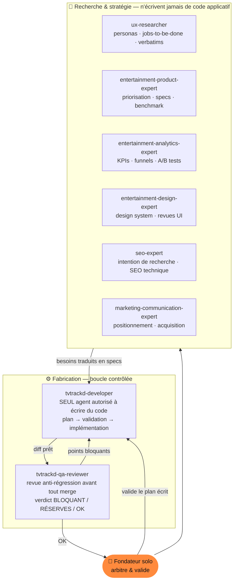

<div align="center">

# tvtrackd

**Le tracker de séries et de films fiable, rapide et francophone — pensé pour le rituel du visionnage nocturne.**

_Un produit conçu et piloté en solo, orchestré par une équipe d'agents IA spécialisés._

<br/>


</div>

---

## Pourquoi ce projet existe

Le **15 juillet 2026, TV Time ferme.** L'un des plus gros trackers de séries au monde (25M+ d'utilisateurs revendiqués) est abandonné par son éditeur qui pivote vers l'IA — avec à peine deux semaines de préavis. Du jour au lendemain, des millions de personnes risquent de perdre un historique de visionnage accumulé sur des années.

L'alternative française naturelle, **Betaseries**, a la marque et la communauté mais une exécution technique datée : bugs de synchronisation, désarchivage cassé, bot de recommandation en panne une fois sur deux, lenteurs signalées depuis des années sans correctif.

> **La thèse produit :** il y a un vide pour un tracker qui fait _bien_ les choses basiques — fiable, rapide, sans bug — sur le marché francophone. On ne réinvente pas la catégorie : on l'exécute correctement là où les acteurs en place échouent.

### Le vrai besoin utilisateur (jobs-to-be-done)

| # | Besoin | Ce que ça implique |
|---|--------|--------------------|
| 1 | **Tracker fiable** | Marquer vu / à voir, calendrier des sorties, sans bug ni lenteur |
| 2 | **Mémoire durable** | Un historique de plusieurs années qu'on ne veut plus jamais perdre — l'export de données devient un **argument produit**, pas un détail |
| 3 | **Découverte qui marche** | Des recommandations pertinentes, pas du remplissage marketing cassé |

---

## Ce qui rend ce repo différent : un produit piloté en solo avec une équipe d'agents IA

Ce projet n'est pas seulement une app — c'est une **méthode de développement**. Une seule personne côté produit, mais une organisation complète simulée par des **agents IA spécialisés**, chacun avec un périmètre strict, des règles d'écriture et un droit de veto. L'humain arbitre et valide ; les agents recherchent, planifient, implémentent, relisent.

### L'équipe d'agents



### Les règles qui rendent ça sérieux (pas un gadget)

- **Un seul agent écrit du code.** `tvtrackd-developer` est le seul habilité à modifier l'applicatif. Les experts produit / design / SEO / data ne _proposent_ que des specs ; ils ne touchent jamais au code. Cela évite la dérive et garde une frontière nette entre décision et exécution.
- **Plan écrit → validation humaine → implémentation.** Le développeur ne code jamais sans un plan de recherche validé explicitement. On tranche _avant_ d'écrire, pas après.
- **QA anti-régression obligatoire avant merge.** `tvtrackd-qa-reviewer` relit chaque diff avec un mandat précis : trouver les **régressions sur l'existant**. Il rend un verdict, ne corrige rien lui-même, et renvoie les points bloquants au développeur. Plusieurs bugs latents ont été trouvés ainsi _avant_ d'atteindre `main` (écrasement silencieux de statut, contraste inaccessible sur le compteur signature…).
- **La discovery précède le code.** Un vrai dossier UX ([`etude-ux-tvtrackd.md`](./etude-ux-tvtrackd.md)), une roadmap priorisée par impact ([`ROADMAP.md`](./ROADMAP.md)), une étude de mots-clés ([`docs/seo/`](./docs/seo/)) et un plan marketing ([`MARKETING.md`](./MARKETING.md)) nourrissent chaque décision de build.

> C'est le point que je veux mettre en avant : **penser comme un studio produit à une seule personne.** La valeur n'est pas « j'ai utilisé de l'IA » — c'est l'orchestration, les garde-fous, et la discipline plan → revue → merge qui font que le code livré reste fiable.

_Le détail des rôles et des politiques d'écriture vit dans [`.claude/agents/`](./.claude/agents) et [`AGENTS.md`](./AGENTS.md)._

---

## Stack technique

| Couche | Choix | Pourquoi |
|--------|-------|----------|
| Front | **React 19 + TanStack Start** (SSR), TanStack Router / Query, Tailwind v4, Radix UI | SSR pour le SEO des fiches série/film, routing typé, cache serveur intégré |
| Back | **Supabase** — Postgres, Auth, Edge Functions (Deno), Cron, Storage | Backend complet, RLS stricte sur chaque table utilisateur |
| Données | **TMDb API** | Films + séries + images gratuits en une seule source ; cache partagé côté DB avec TTL 24-48 h pour ne pas multiplier les appels |
| Qualité | TypeScript strict, ESLint, Prettier, **Vitest** | — |

**Choix documenté :** TMDb plutôt que TheTVDB (meilleure précision horaire mais licence commerciale payante, non viable pour un MVP gratuit). Décision réévaluable seulement si la précision horaire devient un vrai pain point remonté.

---

## Fonctionnalités

**Livré**
- 🔐 Auth Supabase (email/mot de passe)
- 🔎 Recherche TMDb + fiches série/film avec cache partagé
- 📺 **Tracking épisode par épisode** avec gestion native des rewatchs (`watch_status` : une ligne par visionnage, jamais un booléen)
- 📚 Bibliothèque par statut (à voir / en cours / terminé / abandonné / archivé) — **le désarchivage fonctionne** (le bug précis qui rend Betaseries frustrant)
- 🗓️ Accueil « Ce soir » (talon de billet) + rail « Programme » + écran calendrier dédié
- ⬆️ **Import CSV / JSON / ZIP** des exports TV Time & Betaseries, avec détection explicite de format, matching TMDb et **statut déduit** (jamais tout marqué « en cours » à l'aveugle)
- ⬇️ Export JSON des données utilisateur — la portabilité comme argument de confiance
- 🖼️ Génération de cartes de partage, page SEO « alternative à TV Time », pages légales FR

**Backlog priorisé** (voir [`ROADMAP.md`](./ROADMAP.md))
Notifications nouvel épisode · moteur de recommandation fiable · tracking film complet (date + rewatch) · profil public en lecture seule · import Trakt (OAuth) · scrobbling streaming.

---

## Direction design — la signature

Concept : évoquer le **rituel du visionnage** — la cassette, le compteur qui défile, le programme TV du soir — avec une exécution 2026, pas un pastiche. « Vidéo-club nocturne modernisé ».

L'élément signature : le suivi de progression n'est **jamais** une checkbox générique, mais un **compteur mécanique façon bande VHS** (chiffres en IBM Plex Mono, léger défilement à l'incrément). Tout le reste reste sobre et discipliné autour de cet unique risque esthétique assumé.

```
--bg-void: #0B0E14      écran éteint      --accent-amber: #FF8A3D   CTA, « en cours »
--bg-surface: #151A24   cartes            --accent-cyan:  #4DD9C4   « vu », succès, stats
--text-primary: #F2EDE4 blanc phosphore   Titres: Archivo Expanded · Corps: Inter · Chiffres: IBM Plex Mono
```

Un [skill dédié `anti-ia-slop`](./.claude/skills/anti-ia-slop) garde-fou contre les esthétiques de génération IA « par défaut » : chaque choix visuel doit être ancré dans le concept produit, pas dans la moyenne d'un template.

---

## Architecture du repo

```
src/
├─ routes/               TanStack Start (SSR) — _public / _authenticated / legal
│  ├─ _public/           accueil, recherche, fiche show, calendrier, alternative-tv-time
│  └─ _authenticated/    bibliothèque, import, profil, admin
├─ components/           show · home · import · profile · onboarding · ui (design system)
├─ lib/                  app-config, import-parsers, share-card, métriques admin…
└─ integrations/supabase client typé

supabase/
├─ functions/            search-media · get-show-details · import-history · export-data
│                        · public-calendar · trending-media · similar-media …
└─ migrations/           schéma versionné (shows, seasons, episodes, user_shows, watch_status)

docs/                    product/ · design/ · seo/     — dossiers de discovery
.claude/agents/          l'équipe d'agents IA          — voir plus haut
```

---

## Démarrer en local

```bash
bun install
# Renseigner un fichier .env avec les clés Supabase & TMDb
bun run dev               # serveur de dev (SSR)
```

```bash
bun run test              # Vitest
bun run lint              # ESLint
bun run build             # build de production (SSR)
```

---

<div align="center">

_Construit pour les gens qui n'ont pas envie de perdre dix ans d'historique de séries une deuxième fois._

</div>
