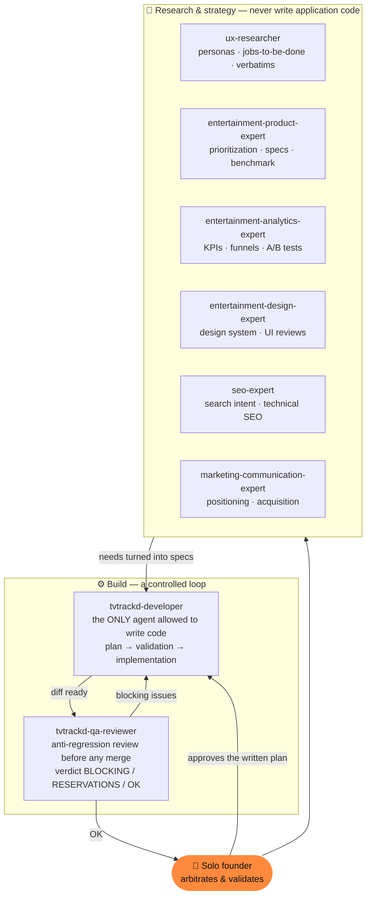

<div align="center">

# tvtrackd

**A reliable, fast, French-first tracker for TV shows and movies — built around the ritual of a night in front of a screen.**

_A product designed and driven solo on the product side, orchestrated by a team of specialized AI agents._

<br/>


</div>

---

## Why this project exists

On **July 15, 2026, TV Time shuts down.** One of the largest TV-show trackers in the world (25M+ claimed users) is being abandoned by its owner, who is pivoting to AI — with barely two weeks' notice. Overnight, millions of people risk losing a viewing history built up over years.

The natural French alternative, **Betaseries**, has the brand and the community but a dated, unreliable technical execution: sync bugs, broken un-archiving, a recommendation bot that fails half the time, and slowness reported for years without a fix.

> **The product thesis:** there's a gap for a tracker that does the _basics_ well — reliable, fast, bug-free — for the French-speaking market. We're not reinventing the category; we're executing it correctly where the incumbents fail.

### The real user need (jobs-to-be-done)

| # | Need | What it implies |
|---|------|-----------------|
| 1 | **Reliable tracker** | Mark watched / to-watch, release calendar — no bugs, no lag |
| 2 | **Durable memory** | A multi-year history you never want to lose again — data export becomes a **product argument**, not a footnote |
| 3 | **Discovery that works** | Relevant recommendations, not broken marketing filler |

---

## What makes this repo different: a solo-driven product built with a team of AI agents

This project isn't just an app — it's a **development method**. One person on the product side, but a full organization simulated by **specialized AI agents**, each with a strict scope, its own writing rules, and veto power. The human arbitrates and validates; the agents research, plan, implement, and review.

### The agent team



### The rules that make it serious (not a gimmick)

- **Only one agent writes code.** `tvtrackd-developer` is the only one allowed to touch the application. The product / design / SEO / data experts only _propose_ specs; they never touch the code. This prevents drift and keeps a clean line between decision and execution.
- **Written plan → human validation → implementation.** The developer never writes code without a research plan that's been explicitly approved. Decisions are made _before_ writing, not after.
- **Mandatory anti-regression QA before merge.** `tvtrackd-qa-reviewer` reviews every diff with a precise mandate: find **regressions on existing features**. It returns a verdict, fixes nothing itself, and sends blocking issues back to the developer. Several latent bugs were caught this way _before_ reaching `main` (silent status overwrite, inaccessible contrast on the signature counter, and more).
- **Discovery precedes code.** A real UX dossier ([`etude-ux-tvtrackd.md`](./etude-ux-tvtrackd.md)), a roadmap prioritized by impact ([`ROADMAP.md`](./ROADMAP.md)), a keyword study ([`docs/seo/`](./docs/seo/)), and a marketing plan ([`MARKETING.md`](./MARKETING.md)) feed every build decision.

> This is the point worth highlighting: **thinking like a one-person product studio.** The value isn't "I used AI" — it's the orchestration, the guardrails, and the plan → review → merge discipline that keep shipped code reliable.

_Role definitions and writing policies live in [`.claude/agents/`](./.claude/agents) and [`AGENTS.md`](./AGENTS.md)._

---

## Tech stack

| Layer | Choice | Why |
|-------|--------|-----|
| Front | **React 19 + TanStack Start** (SSR), TanStack Router / Query, Tailwind v4, Radix UI | SSR for show/movie-page SEO, typed routing, built-in server cache |
| Back | **Supabase** — Postgres, Auth, Edge Functions (Deno), Cron, Storage | Full backend, strict RLS on every user table |
| Data | **TMDb API** | Movies + shows + images, free, from a single source; a shared DB-side cache with a 24-48h TTL avoids redundant API calls |
| Quality | Strict TypeScript, ESLint, Prettier, **Vitest** | — |

**Documented choice:** TMDb over TheTVDB (better airtime precision, but a paid commercial license — not viable for a free MVP). Revisited only if airtime precision becomes a real, user-reported pain point.

---

## Features

**Shipped**
- 🔐 Supabase auth (email/password)
- 🔎 TMDb search + show/movie pages with a shared cache
- 📺 **Episode-by-episode tracking** with native rewatch support (`watch_status`: one row per view, never a boolean)
- 📚 Library by status (to-watch / watching / finished / dropped / archived) — **un-archiving works** (the exact bug that makes Betaseries frustrating)
- 🗓️ "Tonight" home hero (ticket stub) + "Schedule" rail + a dedicated calendar screen
- ⬆️ **CSV / JSON / ZIP import** of TV Time & Betaseries exports, with explicit format detection, TMDb matching, and **inferred status** (never blindly marking everything as "watching")
- ⬇️ JSON export of user data — portability as a trust argument
- 🖼️ Share-card generation, an "alternative to TV Time" SEO page, French legal pages

**Prioritized backlog** (see [`ROADMAP.md`](./ROADMAP.md))
New-episode notifications · a reliable recommendation engine · full movie tracking (date + rewatch) · read-only public profiles · Trakt import (OAuth) · streaming scrobbling.

---

## Design direction — the signature

Concept: evoke the **ritual of watching** — the cassette, the counter ticking over, tonight's TV listings — with a 2026 execution, not a pastiche. A "modernized late-night video store".

The signature element: progress tracking is **never** a generic checkbox, but a **mechanical VHS-tape counter** (IBM Plex Mono digits, a light roll animation on increment). Everything else stays restrained and disciplined around that single, deliberate aesthetic risk.

```
--bg-void: #0B0E14      screen off        --accent-amber: #FF8A3D   CTA, "watching"
--bg-surface: #151A24   cards             --accent-cyan:  #4DD9C4   "watched", success, stats
--text-primary: #F2EDE4 warm phosphor     Headings: Archivo Expanded · Body: Inter · Numbers: IBM Plex Mono
```

A dedicated [`anti-ia-slop` skill](./.claude/skills/anti-ia-slop) guards against "default" AI-generated aesthetics: every visual choice must be anchored in the product concept, not in the average of a template.

---

## Repo architecture

```
src/
├─ routes/               TanStack Start (SSR) — _public / _authenticated / legal
│  ├─ _public/           home, search, show page, calendar, alternative-tv-time
│  └─ _authenticated/    library, import, profile, admin
├─ components/           show · home · import · profile · onboarding · ui (design system)
├─ lib/                  app-config, import-parsers, share-card, admin metrics…
└─ integrations/supabase typed client

supabase/
├─ functions/            search-media · get-show-details · import-history · export-data
│                        · public-calendar · trending-media · similar-media …
└─ migrations/           versioned schema (shows, seasons, episodes, user_shows, watch_status)

docs/                    product/ · design/ · seo/     — discovery dossiers
.claude/agents/          the AI agent team             — see above
```

---

## Run it locally

```bash
bun install
# Fill a .env file with your Supabase & TMDb keys
bun run dev               # dev server (SSR)
```

```bash
bun run test              # Vitest
bun run lint              # ESLint
bun run build             # production build (SSR)
```

---

<div align="center">

_Built for people who don't want to lose ten years of viewing history a second time._

</div>
